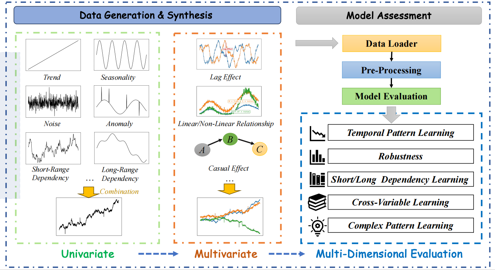

# SynTSBench: A Synthetic Time Series Benchmark for Evaluating Deep Learning Models (NeurIPS 2025)

## Overview

SynTSBench is a comprehensive benchmark framework for evaluating time series deep learning models on synthetic data with controlled characteristics. This repository contains tools for:

1. **Synthetic Data Generation**: Generate time series with specific patterns like trends, seasonality, noise, multivariate relationships, etc.
2. **Model Evaluation**: Evaluate multiple state-of-the-art time series models on the synthetic data
3. **Benchmarking**: Compare model performance across different data characteristics and forecasting tasks

SynTSBench helps researchers and practitioners understand which deep learning architectures are best suited for specific time series patterns and characteristics.

## Framework Overview

<div align="center">
  
  
  **Figure 1: Overview of SynTSBench Framework**
</div>

SynTSBench is a synthetic data-based evaluation framework for time series forecasting models. As illustrated in the figure above, the framework employs a systematic approach to assess model capabilities:

1. **Data Generation Layer**: The framework generates controlled time series data from basic univariate components (such as trends, seasonality, and noise) to complex multivariate patterns with defined inter-variable relationships.

2. **Evaluation Dimensions**: The framework systematically assesses model capabilities across multiple dimensions:
   - **Temporal Pattern Learning**: Evaluates the model's ability to capture fundamental temporal patterns like trends and seasonality
   - **Robustness**: Tests the model's resistance to disturbances such as noise and outliers
   - **Dependency Modeling**: Assesses the model's capability to understand and leverage complex dependencies among multiple variables
   - **Complex Pattern Recognition**: Tests the model's performance on non-linear patterns, long-term dependencies, and other complex scenarios

3. **Controllability Advantage**: Through synthetic data generation, we can precisely control various data characteristics, enabling deep insights into the strengths and limitations of different model architectures in specific scenarios.

## Key Features

- **Synthetic Data Generation**: Generate diverse time series datasets with controlled properties like:
  - Trends (linear, non-linear)
  - Seasonal patterns (with varying periods)
  - Noise levels
  - Anomalies
  - Multivariate relationships
  - Short/long range dependencies
  - Complex patterns


- **Multiple Tasks Support**:
  - Long-term forecasting
  - Short-term forecasting
  - Imputation
  - Anomaly detection
  - Classification

- **Extensive Model Library**: Includes 30+ state-of-the-art time series models:
  - Transformer-based (Transformer, Informer, Autoformer, etc.)
  - CNN-based (TimesNet, etc.)
  - RNN-based (SegRNN, etc.)
  - MLP-based (DLinear, TSMixer, etc.)
  - Advanced architectures (TimeMixer, TimeKAN, TimeLLM, Mamba, etc.)

## Repository Structure

- `dataset/`: Jupyter notebooks for generating synthetic time series
- `data_provider/`: Data loading and processing utilities
- `exp/`: Experiment modules for different tasks
- `layers/`: Neural network layer implementations
- `models/`: Time series model implementations
- `scripts/`: Utility scripts for running experiments
- `tutorial/`: Tutorial notebooks
- `utils/`: Utility functions for data processing and evaluation

## Installation

```bash
# Clone the repository
git clone https://github.com/username/SynTSBench.git
cd SynTSBench

# Install requirements
pip install -r requirements.txt
```

## Quick Start

### Generate Synthetic Data

Use the notebooks in the `dataset/` directory to generate synthetic time series datasets with specific properties.

### Run a Benchmark

```bash
python run.py \
  --task_name long_term_forecast \
  --is_training 1 \
  --model_id experiment1 \
  --model TimesNet \
  --data generated \
  --root_path ./data/ \
  --data_path generated_trend.csv \
  --features M \
  --seq_len 96 \
  --label_len 48 \
  --pred_len 96 \
  --e_layers 2 \
  --d_model 512 \
```


## Available Models

SynTSBench includes 30+ time series models such as:

- Transformer-based: `Transformer`, `Informer`, `Autoformer`, `FEDformer`, `Pyraformer`, `ETSformer`, `iTransformer`, `PatchTST`, `Crossformer`, `LightTS`, `Reformer`, `CATS`
- MLP-based: `DLinear`, `TSMixer`, `TimeMixer`, `PaiFilter`, `TexFilter`, `N-BEATS`
- CNN-based: `SCINet`, `TimesNet`
- RNN-based: `SegRNN`, `TPGN`
- Advanced architectures: `TimeLLM`, `TimeKAN`, `Mamba`, `MambaSimple`, `Koopa`

## Customizing Experiments

### Creating Custom Data Generators

Add custom data generation scripts in the `dataset/` directory.

### Adding New Models

1. Create a new model file in the `models/` directory
2. Implement the model following the interface of other models
3. Add the model to `MODEL_CONFIGS` in `generate_model_script.py`

## Collecting Results

After running experiments, use the collection scripts to gather results:

```bash
python collect_results.py
```

## Citation

If you use this code, please cite:

> to be updated 
```
@article{syntsbench2023,
  title={SynTSBench: A Synthetic Time Series Benchmark for Evaluating Deep Learning Models},
  author={...},
  journal={...},
  year={2023}
}
```

## License

This project is licensed under the MIT License - see the LICENSE file for details.


## Acknowledgement

Our implementation adapts [Time-Series-Library](https://github.com/thuml/Time-Series-Library) as the code base and have extensively modified it to our purposes. We thank the authors for sharing their implementations and related resources.